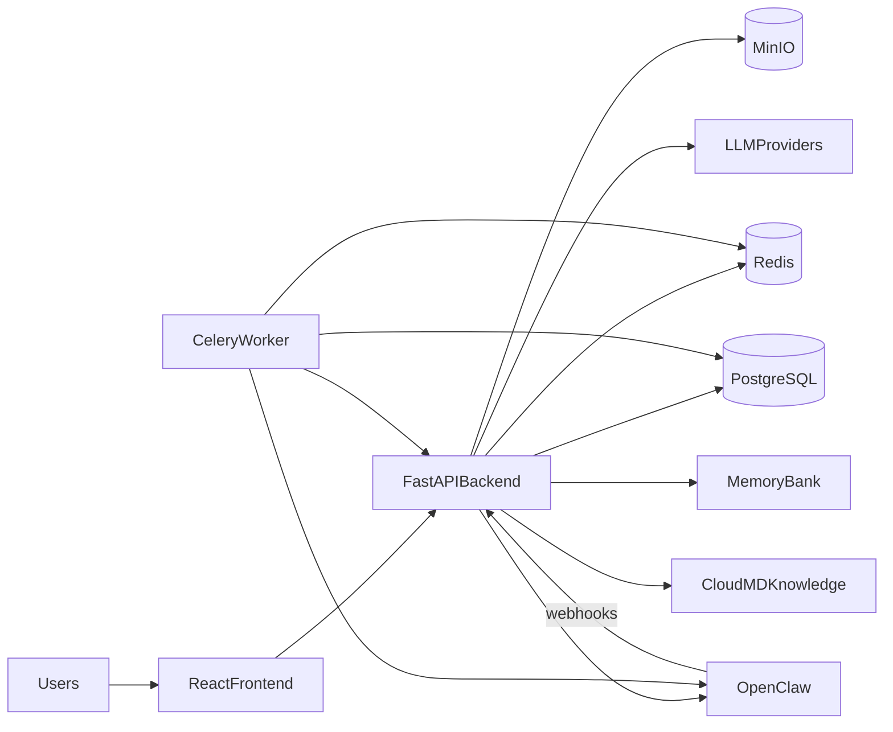

# Universal CRM Architecture (Editable)

Этот файл предназначен для регулярного редактирования по мере развития проекта.

## High-Level Diagram

## Domain Blocks

- `Core CRM`: projects, tasks, users, documents, risks.
- `AI Assistant`: task auto-creator, assignee recommender, load analysis, task updater.
- `Proactive Module`: rule engine, scheduler, response handler.
- `Knowledge Layer`: Memory Bank + Cloud MD with retrieval pipeline.

## Notes For Updates

- Добавляйте новые узлы при расширении интеграций.
- Уточняйте связи в диаграмме перед каждым крупным релизом.
- Сохраняйте этот файл как «источник истины» по архитектуре.
